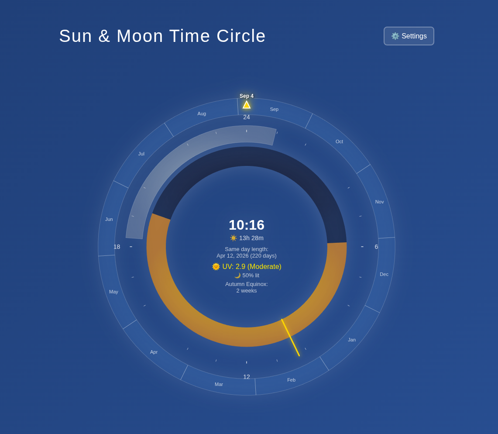

# Sun & Moon Time Circle

A beautiful, interactive 24-hour time visualization that displays the relationship between sunlight, moonlight, and time in a circular format. Built with D3.js for smooth, responsive graphics.



## Features

### 🌅 Solar Information
- **Real-time sunrise/sunset visualization** with golden day arcs and dark night arcs
- **Day length calculation** showing exact hours and minutes of daylight
- **Solar positioning** with azimuth and altitude data
- **Matching day length finder** - discover when the opposite season will have the same day length

### 🌙 Lunar Information  
- **Moon phase display** with real-time illumination percentage
- **Moonrise/moonset times** visualized as silver arcs
- **Moon phase names** (New Moon, Waxing Crescent, etc.)
- **Moon positioning** with azimuth and altitude data

### 📅 Astronomical Events
- **Equinox/solstice countdown** showing days until the next seasonal event
- **Season awareness** with automatic season detection
- **Astronomical calculations** for precise timing

### 🌍 Location Features
- **Automatic location detection** via browser geolocation
- **Manual location override** with latitude/longitude coordinates  
- **Global compatibility** - works anywhere on Earth
- **Location persistence** - remembers your preferences

### ⚙️ Technical Features
- **API integration** with IP Geolocation Astronomy API for precise data
- **Fallback calculations** ensure the app works even without internet
- **Local caching** reduces API calls and improves performance
- **API key management** with secure localStorage storage
- **Real-time updates** with smooth D3.js transitions

## Quick Start

1. **Open the app** - Simply open `index.html` in a web browser
2. **Allow location access** (optional) - for accurate local times
3. **Add API key** (optional) - click ⚙️ Settings for enhanced accuracy
4. **Enjoy!** - Watch the sun and moon arcs update in real-time

## API Setup (Optional)

For the most accurate astronomical data:

1. Get a free API key from [IP Geolocation](https://ipgeolocation.io/)
2. Click the ⚙️ Settings button in the app
3. Paste your API key and save
4. Optionally override your location with specific coordinates

**Note:** The app works perfectly without an API key using built-in astronomical calculations.

## Understanding the Visualization

### The Circle Layout
- **24 at top** - Midnight position (12 o'clock)
- **6 at right** - 6 AM position (3 o'clock)  
- **12 at bottom** - Noon position (6 o'clock)
- **18 at left** - 6 PM position (9 o'clock)

### Arc Colors
- **Golden arcs** - Daylight hours (sunrise to sunset)
- **Dark blue arcs** - Nighttime hours  
- **Silver arcs** - Moon visibility (moonrise to moonset)
- **Yellow hand** - Current time indicator

### Central Information
- **Current time** in 24-hour format
- **Day length** (sunrise to sunset duration)
- **Sunrise/sunset times** 
- **Moon phase** with illumination percentage
- **Next equinox/solstice** countdown
- **Matching day length** date finder

## Technical Architecture

### Core Technologies
- **D3.js v7** - Data visualization and SVG manipulation
- **Vanilla JavaScript** - No framework dependencies
- **CSS3** - Responsive design and animations
- **HTML5** - Modern web standards

### Key Components
- `d3-time-circle.js` - Main D3 visualization engine
- `astronomical-api.js` - API integration and fallback calculations  
- `calculations.js` - Equinox/solstice and day-length algorithms
- `app.js` - Application controller and user interface
- `styles.css` - Visual design and responsiveness

### Data Sources
- **Primary:** IP Geolocation Astronomy API
- **Fallback:** Built-in astronomical algorithms
- **Location:** Browser Geolocation API + manual override

## Browser Compatibility

- **Chrome** 60+ ✅
- **Firefox** 55+ ✅  
- **Safari** 12+ ✅
- **Edge** 79+ ✅
- **Mobile browsers** ✅

## Development

### Running Locally
```bash
# Simple HTTP server (Python 3)
python -m http.server 8000

# Or Node.js
npx http-server

# Then open http://localhost:8000
```

### Project Structure
```
sun_thing/
├── index.html              # Main application page
├── styles.css              # Visual styling
├── app.js                  # Application controller
├── d3-time-circle.js       # D3 visualization engine
├── astronomical-api.js     # API & calculations
├── calculations.js         # Astronomical algorithms
└── README.md              # This file
```

## Customization

### Changing Colors
Edit the gradient definitions in `d3-time-circle.js`:
```javascript
// Day gradient (golden sun)
dayGradient.append('stop')
  .attr('stop-color', '#ffd700')  // Change this color

// Night gradient (dark blue)
nightGradient.append('stop') 
  .attr('stop-color', '#1a1a2e')  // Change this color
```

### Adjusting Update Frequency
Modify the update intervals in `app.js`:
```javascript
// Time updates (default: every minute)
setInterval(() => this.updateCurrentTime(), 60000);

// Data refresh (default: every 5 minutes)  
setInterval(() => this.loadAstronomicalData(), 5 * 60 * 1000);
```

### Adding New Calculations
Extend `calculations.js` with additional astronomical functions and display them in the center info area.

## Credits

- **Astronomical calculations** based on standard celestial mechanics
- **D3.js visualization** inspired by traditional astronomical instruments
- **API integration** powered by IP Geolocation services

## License

MIT License - Feel free to use, modify, and distribute.

---

*Built with ❤️ using Claude Code*